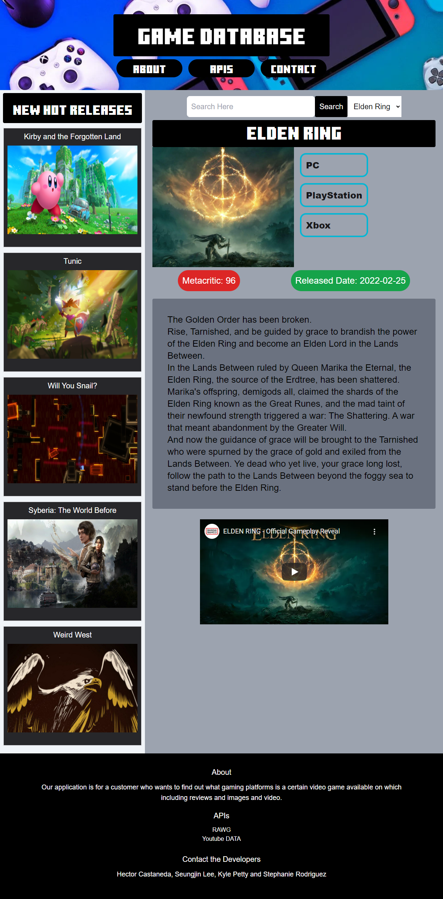

# GamePlatforms

## Description
This application can search a game title via API1 and API2 and provide details of said game. Search your game in the search bar, pick specific game title. Then all information about game is displayed, along with a trailer of the game. The sidebar displays the newest popular released games, which your able to click on to find out more about it and watch trailer to see if its a game you might enjoy.

## Built
* HTML
* CSS
* JavaScript
* Tailwind
* jQuery

## API's Used
* https://rawg.io/apidocs 
* https://developers.google.com/youtube/v3 

## Screenshot



## Link

https://uhmammoth.github.io/GamePlatforms/

https://github.com/uhMammoth/GamePlatforms.git

## Requirements
```
Use a CSS framework other than Bootstrap.

Be deployed to GitHub Pages.

Be interactive (i.e., accept and respond to user input).

Use at least two server-side APIs.

Does not use alerts, confirms, or prompts (use modals).

Use client-side storage to store persistent data.

Be responsive.

Have a polished UI.

Have a clean repository that meets quality coding standards (file structure, naming conventions, follows best practices for class/id naming conventions, indentation, quality comments, etc.).

Have a quality README (with unique name, description, technologies used, screenshot, and link to deployed application).
```
## Collaborators
> [Hector Castaneda](https://github.com/Hectcast508)

> [Stephanie Rodriguez](https://github.com/stephrrcodes)

> [Seungjin Lee](https://github.com/infinissible)

> [Kyle Petty](https://github.com/uhMammoth)
